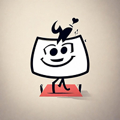

<!DOCTYPE html>
<html lang="en">
<head>
  <meta charset="UTF-8">
  <meta name="viewport" content="width=device-width, initial-scale=1">
  <!-- Link to your custom stylesheet -->
  <link rel="stylesheet" href="styles.css">
  <!-- Optional: Link to Font Awesome for icons -->
  <link rel="stylesheet" href="https://cdnjs.cloudflare.com/ajax/libs/font-awesome/6.1.1/css/all.min.css">
</head>
<body>
  <!-- Main Navigation -->
  <header>
    <nav>
      <ul class="navbar">
        <li><a href="#home">Home</a></li>
        <li><a href="#about">About</a></li>
        <li><a href="#competences">Skills</a></li>
        <li><a href="#projets">Projects</a></li>
        <li><a href="#stats">Statistics</a></li>
        <li><a href="#contact">Contact</a></li>
      </ul>
    </nav>
  </header>
  
  <!-- Section Home -->
  <section id="home" class="section home">
    

      <h1>Arnaud Oltra</h1>
      <h3>
        Full stack Developer | PHP - JS - Python 
        Symfony Specialist, Advocate for Clean Code &amp; Efficiency 
        Open Source Contributor
      </h3>
    

  </section>
  
  <!-- Section About Me -->
  <section id="about" class="section about">
    

      <h2>About Me</h2>
      

        I am a dedicated PHP developer with a passion for clean code and SOLID principles. While I remain a staunch advocate for PHP, I’m always ready to switch technologies when the need arises.
      

      

        My professional life is a balanced blend of working as an in-house developer—helping companies with seamless migrations and the implementation of robust, scalable architectures—and dedicating my personal time to innovative projects. One of these projects is <strong>TerpsiConnect</strong>, a platform designed to connect amateur dancers with engaging social events.
      

      

        I am available to support businesses from pre-startup to scale-up with my expertise. Additionally, I author a newsletter that explores the balance between corporate life and the journey of building SaaS products.
      

    

  </section>
  
  <!-- Section Skills -->
  <section id="competences" class="section competences">
    

      <h1 align="left">💼 Skills</h1>
      

        
        
         
         
         
        
        
      

      <h1 align="left">💻 Tools</h1>
      

        
        
           
        
        
        
      

    

  </section>
  
  <!-- Section Projects -->
  <section id="projets" class="section projets">
    

      <h2>My Projects</h2>
      

        

          
          <h3>Terpsi Connect</h3>
          
TerpsiConnect transforms the way you experience nightlife by providing you with a dynamic interactive map to discover dance events near you. Whether you are passionate about dance or looking for an exciting night out, our application makes it easy to find the best dance venues and add new events in real-time.

          <a href="https://terpsiconnect.com/" target="_blank">View Project</a>

          
        

        

          
          <h3>Funny-quote</h3>
          
A library to generate funny quotes.

          <a href="https://packagist.org/packages/ol.arno/funny-quote-lib" target="_blank">View Project</a>
        

        <!-- Add other projects if necessary -->
      

    

  </section>
  
  <!-- Section GitHub Statistics -->
  <section id="stats" class="section stats">
    

      <h2>My GitHub Statistics</h2>
      

        
        
        
      

    

  </section>
  
  <!-- Section Contact -->
  <section id="contact" class="section contact">
    

      <h2>Contact Me</h2>
      
For any collaboration requests or further information, feel free to contact me using the form below or by email at <a href="mailto:arnaudoltra@hotmail.fr">arnaudoltra@hotmail.fr</a>.

      
You can also schedule a discussion with me <a href="https://calendly.com/olarno/let-s-discuss-your-project?month=2025-02">here</a>.

    

  </section>
  
  <!-- Footer -->
  <footer>
    

      
&copy; 2025 Arnaud Oltra. All rights reserved.

      

        <a href="https://github.com/olarno" target="_blank"><i class="fab fa-github"></i></a>
        <a href="https://www.linkedin.com/in/arnaud-oltra/" target="_blank"><i class="fab fa-linkedin"></i></a>
        <!-- Add other social links if needed -->
      

    

  </footer>
</body>
</html>
